# KoruBeni — Competitive, Monetization & Compliance Research
**Date:** 2026-06-29 · **Status:** Evidence-first research deliverable · **Scope:** Personal-safety apps (global + Turkey)

> Constraints honored: no source code modified; public sources only; every significant claim carries ≥2 independent sources in [`evidence-log.csv`](evidence-log.csv) or is explicitly flagged *low confidence*. Machine-readable companions: [`competitor-profiles.csv`](competitor-profiles.csv), [`feature-permissions-matrix.csv`](feature-permissions-matrix.csv), [`monetization-pricing.csv`](monetization-pricing.csv), [`revenue-estimates.csv`](revenue-estimates.csv), [`hypotheses.csv`](hypotheses.csv), [`research-notes.json`](research-notes.json).

---

## 1. Executive Summary

**The category is real and monetizable, but KoruBeni is entering a market with one dominant commercial leader, a free government incumbent in its home market, and a feature baseline it does not yet meet.**

1. **Life360 owns the category.** FY2025 revenue **USD 489.5M** (+32% YoY), of which **USD 369.3M** is subscription, **2.8M paying circles**, **~95.8M MAU**, **100M+ installs** [E01–E07]. It is the playbook: freemium + 3 paid tiers (USD 69.99 / 99.99 / 199.99 per year) + 7-day trial.
2. **Pricing splits by promise.** Apps that just alert *your own contacts* price low (bSafe ~USD 2–4/mo); apps that promise *monitored human dispatch or live agents* price high (Noonlight USD 5–10/mo, Citizen USD **19.99/mo**) [E09,E12,E14].
3. **In Turkey, the incumbent is free and governmental.** **KADES** (Ministry of Interior / EGM) has **~9.7M downloads** and **2.1M+ reports**, with *direct police dispatch* [E17]. KoruBeni cannot compete on "official rescue" and **must clearly disclaim that it is not KADES / not an official emergency service**.
4. **KoruBeni's biggest functional gap is table-stakes:** every competitor that shares location also **auto-sends it to contacts/responders**; KoruBeni (offline-first) does **not** [E10,E16,E18,E30]. This is the #1 product recommendation.
5. **KoruBeni's biggest strategic asset is privacy.** No backend, no analytics/ads, no microphone, no biometric, no background location, no auto-exfiltration. This is a genuine, marketable differentiator and materially lowers Play Data-Safety and stalkerware risk [E22,E30].
6. **Three concrete launch blockers** sit in compliance, not features: (a) the `specialUse` foreground service needs a **Play Console declaration + demonstration video** [E19]; (b) **broad `READ_CONTACTS`** is squarely in the path of Google's **April-15-2026** policy steering apps to the **Android Contact Picker** [E20]; (c) KVKK's **March-2026 principle decision** requires the **disclosure (aydınlatma) and consent (açık rıza) texts to be separate approvals** [E23].
7. **Legal posture is solvable by copying the incumbents.** Life360's "**NOT A REPLACEMENT FOR EMERGENCY SERVICES … dial 911/112**" + no-liability-for-false-alarms language is the model to mirror in Turkish [E08].

**Strategic verdict:** Position KoruBeni as the *privacy-first, offline, duress-aware* safety companion — **not** a rescue service. Close the one true feature gap (user-initiated location-to-contacts share that works without a backend), nail the three compliance blockers, and price modestly for the low-ARPU Turkish market.

---

## 2. Competitor Profiles

Full machine-readable version: [`competitor-profiles.csv`](competitor-profiles.csv).

| App | Origin | Scale | Core promise | Pricing | Positioning |
|---|---|---|---|---|---|
| **Life360** | USA | 100M+ installs; ~95.8M MAU; 2.8M paying | Family location + driving/crash + SOS | Silver/Gold/Platinum USD 69.99/99.99/199.99 yr; 7-day trial | Category leader (NASDAQ: LIF) |
| **bSafe** | Norway | 125+ countries; "millions" | SOS + live location + audio/video to "Guardians" | ~USD 2/mo, USD 20/yr, USD 1/24h | Women-walking-alone niche [low conf. on installs] |
| **Noonlight** | USA | "Millions" | Silent 1-button **911 dispatch** w/ human verify | Free core; iOS-only USD 4.99–10/mo; 30-day trial | Real dispatch + B2B2C API |
| **Citizen** | USA | ~5M users; 100k+ Protect subs | Incident alerts + **live human agents** | Protect **USD 19.99/mo** | Crime awareness + premium agents |
| **Hollie Guard** | UK | 45+ police forces | Panic + evidence + **monitored URN escalation** | Free + Extra **GBP 7.99/mo** | Police-aligned + lone-worker B2B |
| **KADES** | Turkey | **~9.7M downloads**; 2.1M+ reports | One-touch **report to police (155)** | **Free** (state) | **Dominant TR incumbent; official** |
| **Pronet Panik Butonu** | Turkey | Tied to Pronet base | Panic → SMS+location + 24/7 alarm center | Monthly/annual sub | TR private monitored option |
| **One Scream** | UK/Global | Niche | **Voice/scream** trigger → call+SMS | Subscription | Hands-free voice niche |
| **Red Panic Button** | RO/Global | Niche | Panic SMS/email + media alert | Free + ~USD 4.99 pro | Cheap utility |
| **Google Personal Safety** | USA | Pre-installed | Emergency SOS, crash, safety check | **Free** (OS) | Commoditized free baseline |
| **KoruBeni** *(subject)* | Turkey | Pre-launch v1.0.0 | Offline fake-call/siren/SOS, no backend | Freemium + Pro (TBD) | **Privacy-first / offline / duress-aware** |

---

## 3. Feature & Permissions Comparison (KoruBeni vs field)

Full matrix (10 apps × 28 rows): [`feature-permissions-matrix.csv`](feature-permissions-matrix.csv). Highlights:

| Capability | KoruBeni | Life360 | bSafe | Noonlight | Citizen | Hollie Guard | KADES |
|---|---|---|---|---|---|---|---|
| SOS / Panic | **Pro** | ✓ | ✓ | ✓ free | ✓ | ✓ | ✓ (police) |
| **Auto-send location to contacts** | **✗ (gap)** | ✓ | ✓ | ✓ | ✓ | ✓ | ✓ |
| Monitored human dispatch | ✗ | Platinum | Prem. | ✓ free | ✓ | Extra | ✓ state |
| Check-in / Safe Walk | **Pro** | ✓ | ✓ | ✗ | ✗ | ✓ | ✗ |
| Fake call | **✓ free** | ✗ | ✓ | ✗ | ✗ | ✗ | ✗ |
| Siren | **✓ free** | ✗ | ✓ | ✗ | ✗ | ✓ | ✗ |
| Audio/video evidence | ✗ *(by design)* | ✗ | ✓ | ✗ | ✓ | ✓ | ✗ |
| **Works fully offline** | **✓ (unique)** | ✗ | ✗ | ✗ | ✗ | partial | ✗ |
| PIN lock / **no biometric** | **✓ / ✓** | ✗ | ✗ | ✗ | ✗ | ✗ | ✗ |
| Developer backend | **✗ (none)** | ✓ | ✓ | ✓ | ✓ | ✓ | ✓ |
| Background location perm. | **✗ (not requested)** | ✓ | ✓ | ✓ | ✓ | ✓ | in-use |
| Microphone perm. | **✗ (removed)** | maybe | ✓ | ✗ | ✓ | ✓ | ✗ |

**Reading:** KoruBeni is *deliberately* lighter on data collection (no backend / mic / biometric / background location) and *uniquely* offline + fake-call-first — but lighter on the live-sharing, recording, and monitored-dispatch features that competitors sell. The privacy posture is the moat; the auto-share gap is the liability.

---

## 4. Monetization & Pricing

Full table: [`monetization-pricing.csv`](monetization-pricing.csv).

- **Model:** the category runs on **freemium auto-renewing subscriptions** [E07,E09,E12,E14,E16]; only Red Panic Button leans one-time IAP.
- **Conversion reality (RevenueCat State of Subscription Apps 2025):** median **download→paid ≈ 2.18%** for freemium; hard paywalls ≈ 12.11%; freemium ≈ 90% of app revenue; lower price → higher trial conversion [E26].
- **Trial:** 7-day (Life360) to 30-day (Noonlight) is standard.
- **Pricing ladder:**

| Promise level | Example | Price |
|---|---|---|
| Utility panic / contact alert | Red Panic Button, bSafe | USD ~2–5/mo (or one-time) |
| Family tracking + extras | Life360 Gold | USD ~8.3/mo (annual) |
| Monitored convenience | Noonlight | USD 5–10/mo |
| Live human agent / dispatch | Citizen Protect | USD 19.99/mo |

**KoruBeni implication:** in Turkey's low-ARPU market, price Pro **modestly** (monthly + discounted annual), use a **7-day trial**, and gate the *highest-value* features (panic auto-call, Safe Walk, check-in escalation) — which is already KoruBeni's plan. Don't gate the free differentiators (fake call, siren) — they drive installs and word-of-mouth.

---

## 5. Monthly Revenue Estimates — Methodology & Results

Full table: [`revenue-estimates.csv`](revenue-estimates.csv).

**Methodology.** Two approaches:
- **(A) Reported** — used only for Life360 (public filings): `monthly = annual_subscription_revenue / 12`.
- **(B) Bottom-up estimate** — for private apps: `monthly_gross ≈ active_base × conversion × blended_price ÷ period`, then `net ≈ gross × (1 − store_fee)` with `store_fee` 30% (first-year) to 15% (retained subs). Conversion default **2.18%** [E26].

| App | Estimate (gross/mo) | Confidence | Notes |
|---|---|---|---|
| **Life360** | **~USD 30.8M** subscription (~USD 39.8M total) | **High (reported)** | Derived ARPPU = 369.3M / 2.8M / 12 ≈ **USD 11.0/mo per paying circle** [E01,E03] |
| Citizen | ~USD 0.5M | Low | Single third-party (Sensor Tower) estimate; subscriber cross-check (35–50k × 19.99 × 0.7) lands same order of magnitude [E15] |
| Hollie Guard | ~USD 70k–210k consumer (+ B2B/B2G) | Low | GBP 7.99/mo × assumed base; police contracts separate [E16] |
| Noonlight | ~USD 50k–200k consumer (B2B larger, undisclosed) | Low | Real business is API/partnerships, not consumer subs [E13] |
| bSafe | ~USD 25k–150k (point ~40k) | Low | Active base + conversion both assumed; micro-subs depress ARPU [E09,E11] |
| One Scream / Red Panic Button | < USD 50k each | Low | Niche / low-cost |
| KADES, Beyaz Kod, Google Personal Safety | **USD 0** | High | Free / government / OS |
| **KoruBeni** *(planning illustration only)* | ~USD 3k/mo @ 100k installs × 2% | n/a | Sensitivity ~USD 1.5k–15k; set TRY price/trial in RevenueCat. **Not evidence.** |

> ⚠️ **Confidence caveat:** outside Life360, **no reliable public monthly-revenue figure exists**; all private-competitor numbers are estimates and should be treated as order-of-magnitude only [E12, H12].

---

## 6. Evidence Log & Hypotheses
- **Evidence:** [`evidence-log.csv`](evidence-log.csv) — 30 claims (E01–E30), each with ≥2 independent URLs + access date, or flagged *Low* if single-source (Citizen revenue E15, Google Personal Safety E29).
- **Hypotheses:** [`hypotheses.csv`](hypotheses.csv) — 14 hypotheses (H1–H14) with confidence + supported/inference status. The strategically load-bearing ones: **H7** (auto-share gap), **H11** (privacy moat), **H8/H9/H10** (compliance blockers), **H4** (KADES incumbency).

---

## 7. Prioritized Product Recommendations

Priority: **P0** = launch blocker, **P1** = high impact pre/at launch, **P2** = post-launch. Effort: L/M/H.

| # | Rec | Type | Team | Priority | Effort | Why (evidence) |
|---|---|---|---|---|---|---|
| 1 | **One-tap "share my location + status" to emergency contacts via device SMS/share sheet** (no backend → stays offline-first) | ADD | Dev/UX | **P1** | M | Closes the category's table-stakes gap without breaking the offline rule [H7,E10,E16] |
| 2 | **Persistent "Not an emergency service — call 112" disclaimer** on panic/onboarding/store listing | ADD | Legal/UX | **P0** | L | Industry-standard; avoids KADES/official confusion [H5,H4,E08,E17] |
| 3 | **Play Console declarations + demo video** for `specialUse` FGS (and full-screen intent if used) | ADD | Dev | **P0** | M | Hard Play requirement since Jan-22-2025 [H9,E19,E21] |
| 4 | **Migrate contact selection to Android Contact Picker** (or file Permissions Declaration justifying broad `READ_CONTACTS`) | MODIFY | Dev/Legal | **P0** | M | April-15-2026 Play policy steers broad contacts → picker [H8,E20] |
| 5 | **Make onboarding present aydınlatma and açık rıza as two separate approvals** (verify not nested) | MODIFY | Legal/UX/Dev | **P0** | L–M | KVKK March-2026 principle decision [H10,E23,E24] |
| 6 | **Pro paywall: show price, renewal, cancellation, and withdrawal-right info in Turkish + Restore + Manage** | MODIFY | Legal/UX | **P0** | L | TR Law 6502 / Distance Contracts disclosure duties [H14,E25] |
| 7 | **Add cross-border-transfer disclosure/consent for RevenueCat (US)** in KVKK text | MODIFY | Legal | **P1** | L | RevenueCat processes subscription data abroad (KVKK m.9) |
| 8 | **Check-in auto-escalation**: SMS to contacts if user misses check-in (parity with bSafe scheduled alarm) | ADD | Dev/UX | **P2** | M | Differentiated value vs free baseline [E09] |
| 9 | **Re-evaluate `SCHEDULE_EXACT_ALARM` → `USE_EXACT_ALARM`** (auto-granted for alarms, no declaration) if eligible | MODIFY | Dev | **P1** | M | Reduces Play review surface [E19] |
| 10 | **Battery-optimization + autostart onboarding education** (reliability vs Doze/OEM) | ADD | Dev/UX | **P1** | M | Reliability rule; competitors rely on backend push, KoruBeni cannot |
| 11 | **Keep NOT adding** background location / microphone / biometric | REMOVE (guard) | Legal/Dev | **P1** | L | Preserves the privacy moat + lowers Play scrutiny [H6,H11,E22] |
| 12 | **Localize store listing + privacy policy + legal texts fully in Turkish**, avoid any official/emblem imagery | MODIFY | Legal/UX | **P0** | M | TR market + anti-impersonation of KADES [E17] |

---

## 8. Store-Readiness Checklist (Google Play + Turkey)

**Google Play — permissions & policy**
- [ ] **`FOREGROUND_SERVICE_SPECIAL_USE`** declared on the App content page with description **+ demonstration video** of the user-triggered safety feature [E19].
- [ ] **`READ_CONTACTS`**: either migrate to **Contact Picker** or submit Permissions Declaration justifying broad access; confirm before the ~30-day window after 2026-04-15 [E20].
- [ ] **No `ACCESS_BACKGROUND_LOCATION`** in manifest or pulled by any plugin (currently clean — keep it that way). Verify with a merged-manifest check.
- [ ] **`SCHEDULE_EXACT_ALARM`** justified (or swapped to `USE_EXACT_ALARM`) — Play treats exact-alarm as sensitive [E19].
- [ ] **`USE_FULL_SCREEN_INTENT`** (if used for fake-call/panic) declared; relies on permitted core-functionality auto-grant [E21].
- [ ] **`CALL_PHONE`** usage disclosed (direct-call core functionality).
- [ ] **`REQUEST_IGNORE_BATTERY_OPTIMIZATIONS`** only requested with in-context rationale (Play restricts blanket use).
- [ ] **Data Safety form** matches reality: location (user-controlled), contacts (local), optional photo (fake-call avatar), **no ads / no analytics / no third-party sharing / no developer backend**; subscription data via Google Play Billing + RevenueCat.
- [ ] **Target API level** current (Android 14/35+) and **16 KB page size** verified.
- [ ] **Account/data deletion** path documented (in-app delete + a stated request channel), per Play data-deletion policy.
- [ ] **Prominent in-context disclosure** for location before the runtime prompt.
- [ ] **Subscriptions:** Restore Purchases, Manage Subscription deep link, and clear price/renewal copy on the paywall.

**Turkey-specific**
- [ ] Store listing, privacy policy, **KVKK aydınlatma**, and Pro subscription terms fully in **Turkish**.
- [ ] **No impersonation** of KADES / official bodies; explicit "**not an official emergency service — for emergencies call 112**" notice.
- [ ] **VERBİS exemption** rationale on file (individual developer / scale) — see `docs/verbis_muafiyet_notu.md`; reconfirm against current thresholds.
- [ ] **Distance-contract pre-sale disclosure** (price incl. taxes, renewal cadence, cancellation, withdrawal-right limits for started digital service) [E25].
- [ ] **Data-breach (veri ihlali) procedure** ready — see `docs/veri_ihlali_bildirimi_proseduru.md`.
- [ ] IARC **age rating** consistent with the 18+ onboarding gate.

---

## 9. KVKK Compliance Gap Matrix

Baseline = `docs/kvkk_veri_isleme_envanteri.md`. **G** = gap to close.

| Requirement | KVKK basis | KoruBeni current | Status |
|---|---|---|---|
| Separate disclosure vs explicit-consent approvals | Principle decision Mar-2026 [E23] | 4-step onboarding (aydınlatma → granular consent) | **G — VERIFY** the two are distinct approvals, not one tap |
| Explicit consent specific/informed/free/revocable | m.5/1, Art.3 [E24] | Granular per-category consent + revoke | OK (confirm wording per category) |
| Lawful basis for **emergency contact's** PII (3rd-party data) | m.5, m.11 | Stored locally; m.11 notice to contact via e-mail | **G** — document basis (consent/meşru menfaat) + minimize; add in-app "inform your contact" prompt |
| Cross-border transfer disclosure (RevenueCat US, map tiles) | m.9 | Envanteri notes provider network behavior | **G** — add explicit transfer notice/consent for RevenueCat |
| Retention limits defined per category | m.4, m.7 | Location not stored ✓; contacts until deleted ✓; audit log "while installed" | OK (state audit-log retention explicitly) |
| Data-subject rights channel (access/erasure/portability) | m.11 | In-app + e-mail, 30-day response | OK |
| Age / minors protection | m.6 | 18+ onboarding gate | OK |
| Audit log of consents | proof (TBK m.50) | SQLite consent audit log | OK |
| No special-category data without explicit consent | m.6 | No biometric, no mic (removed) | OK (strong) |
| VERBİS registration/exemption | KVKK | Exemption note on file | **VERIFY** thresholds |

**Net:** posture is strong; the open gaps are (1) separation of consent/disclosure, (2) emergency-contact third-party basis, (3) RevenueCat cross-border transfer notice.

---

## 10. Abuse-Risk Mitigation Checklist

| Misuse scenario | Risk for KoruBeni | Recommended safeguard |
|---|---|---|
| **Covert tracking / stalkerware** | Low — app shares only the *user's own* location to the *user's own* contacts; no 3rd-party surveillance | Keep FGS persistent notification visible while any session runs; never add silent/stealth tracking [E22] |
| **False / accidental SOS** | Medium | Keep the emergency **countdown + cancel**; add a non-PIN quick-cancel; **Test Mode** to avoid real triggers (already Pro) |
| **Coercion / duress unlock** | Medium | **PIN-only (no biometric)** already mitigates forced biometric unlock; consider a silent duress option that *appears* to comply |
| **Weaponized fake call** | Low | Keep fake call clearly user-initiated; no spoofing of real numbers/agencies |
| **Emergency contact non-consent** | Medium (KVKK) | Prompt user to inform contacts; provide contact-facing KVKK rights notice |
| **Minor use** | Low | 18+ gate retained |
| **Notification content leakage** | Low–Med | Keep sensitive status off lock-screen previews |
| **Over-reliance (treating app as 112)** | **High (safety)** | Persistent "not an emergency service — call 112" disclaimer everywhere [E08,E17] |

---

## 11. Hypothesis Tree

```mermaid
flowchart TD
  R["Can KoruBeni win a defensible niche\n(personal safety, Google Play / Turkey)?"]

  R --> A["Market monetizable for a small player?\n(confidence: medium)"]
  R --> B["Where to differentiate?\n(confidence: high)"]
  R --> C["What are the launch blockers?\n(confidence: high)"]

  A --> A1["H1 Life360 leads & validates category — SUPPORTED (high)"]
  A --> A2["H2 freemium subscription is the model — SUPPORTED (high)"]
  A --> A3["H12 no reliable indie revenue benchmarks; low TR ARPU — SUPPORTED (med)"]

  B --> B1["H11 privacy-minimal / offline-first = real moat — SUPPORTED (high)"]
  B --> B2["H7 but lacks table-stakes auto-location-share — SUPPORTED (high)"]
  B --> B3["H6 lacks evidence recording (by design) — SUPPORTED (high)"]
  B --> B4["H13 cannot offer monitored dispatch w/o backend — INFERENCE (med)"]

  C --> C1["H9 specialUse FGS declaration + demo video — SUPPORTED (high)"]
  C --> C2["H8 broad READ_CONTACTS at risk (Apr-2026) — SUPPORTED (med)"]
  C --> C3["H10 KVKK separate consent/disclosure — SUPPORTED (med)"]
  C --> C4["H5 must disclaim not-emergency + liability — SUPPORTED (high)"]
  C --> C5["H14 TR subscription disclosure / withdrawal — SUPPORTED (high)"]
  C --> C6["H4 must not impersonate KADES/official — SUPPORTED (high)"]
```

---

## 12. Sources & Verification Notes
- **Primary/authoritative** sources preferred: Life360 investor releases, KVKK.gov.tr, Google Play Console Help, T.C. Ticaret Bakanlığı, İçişleri Bakanlığı, official app stores/sites.
- **Single-source / low-confidence flags:** Citizen monthly revenue (Sensor Tower only, E15); bSafe exact install band (vendor "millions", E11); Google Personal Safety (E29). Treat as indicative.
- **Conflict handling:** where listicles disagreed with vendor/store data, store/official data was used and the listicle treated as secondary corroboration only.
- **Recency:** Life360 figures are FY2025 (reported Mar-2026); KADES download count and KVKK/Play policies are as of access date **2026-06-29**.

> **Follow-up (not done here, per instructions):** feed these outputs + the codebase audit (`docs/audit/`) into a combined launch-readiness action plan with file-by-file tasks.
